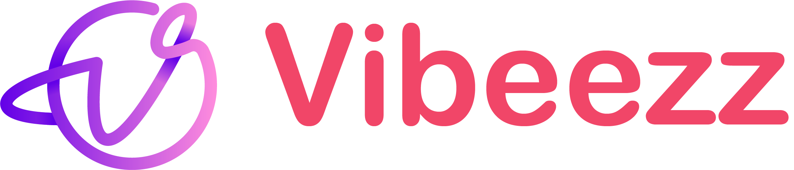

</a>

  <strong>
  <i>
  Taking Your voice conversations to the next Level </i>
  🚀</strong>

<h3 align="center">
  <a href="https://github.com/benawad/dogehouse/blob/staging/CONTRIBUTING.md">Contribute</a>
   · 
  <a href="https://discord.gg/ncGnB9un">Community</a>
   · 
  <a href="https://github.com/benawad/dogehouse/blob/staging/CONTRIBUTING.md">Documentation</a>
</h3>

---

## Branches

- `develop` &#8594; this branch for everything
- `master` &#8594; don't touch, this is what's running in production

## Contributions

Vibeezz is open to contributions, but I recommend creating an issue or replying in a comment to let me know what you are working on first that way we don't overwrite each other.

Please read [CONTRIBUTING.md](https://github.com/vibeezz/vibeezz/blob/master/CONTRIBUTING.md) for details on this project.

## How to run locally

Check <a href="https://github.com/vibeezz/vibeezz/blob/master/CONTRIBUTING.md#manual-full-local-development">here</a> on how to run locally</a>

